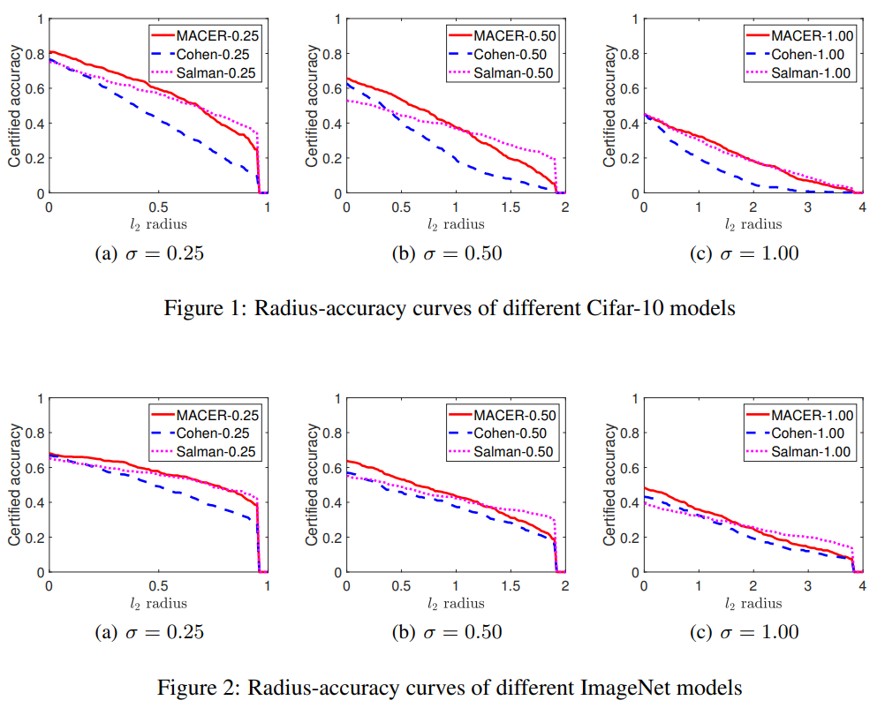
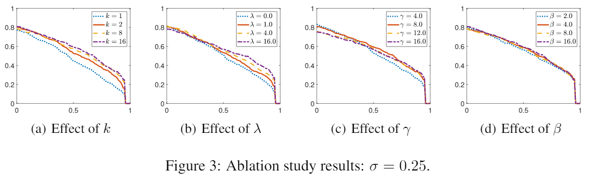

# MACER: Attack-free and Scalable Robust Training via Maximizing Certified Radius
This is a temporary repository containing codes and checkpoints of our paper submitted to ICLR 2020. Our proposed algorithm MACER outperforms all existing provably L2-defenses in both average certified radius and training speed on Cifar-10, ImageNet, MNIST and SVHN. Besides, our method does not depend on any specific attack strategy, which makes it substantially different from adversarial training. Our method is also scalable to modern deep neural networks on a wide range of real-world datasets.

## ICLR Updates
### Updates on Nov 9, 2019 (for rebuttal)
Two more checkpoints are added to the `checkpoint` folder. Their performances and training time are listed below:

| Model | Trained Epochs | Total hrs | 0.00 | 0.25 | 0.50 | 0.75 | 1.00 | 1.25 | 1.50 | 1.75 | ACR |
|------|------|------|------|------|------|------|------|------|------|------|------|
| Salman-0.25 | 150 | 82.92 | 0.74 | 0.67 | 0.57 | 0.47 | 0.00 | 0.00 | 0.00 | 0.00 | 0.538 |
| MACER-0.25 *(new)* | 150 | 21.00 | 0.76 | 0.67 | 0.57 | 0.42 | 0.00 | 0.00 | 0.00 | 0.00 | 0.531 |
| MACER-0.25 | 440 | 61.60 | 0.81 | 0.71 | 0.59 | 0.43 | 0.00 | 0.00 | 0.00 | 0.00 | 0.556 |
| | | | | | | | | | | | |
| Salman-0.50 | 150 | 82.92 | 0.50 | 0.46 | 0.44 | 0.40 | 0.38 | 0.33 | 0.29 | 0.23 | 0.709 |
| MACER-0.50 *(new)* | 150 | 21.00 | 0.62 | 0.57 | 0.50 | 0.44 | 0.38 | 0.29 | 0.21 | 0.13 | 0.712 |
| MACER-0.50 | 440 | 61.60 | 0.66 | 0.60 | 0.53 | 0.46 | 0.38 | 0.29 | 0.19 | 0.12 | 0.726 |


## Anonymity Notice
To follow the double-blind reviewing rule of ICLR, we have made this repository and this Github account anonymous. This is a temporary repository, and will be closed after the review process. We will put the URL of the permanent repository in the final version of our paper.

## Introduction

MACER is an attack-free and scalable robust training algorithm that trains provably robust models by MAximizing the CErtified Radius. The certified radius is provided by a robustness certification method. In this work, we obtain the certified radius using [randomized smoothing](http://proceedings.mlr.press/v97/cohen19c.html).

Because MACER is attack-free, it trains models that are provably robust, i.e. they are robust against any possible attack in the certified region. Additionally, by avoiding time-consuming attack iterations, MACER runs much faster than adversarial training. We conduct extensive experiments to demonstrate that MACER spends less training time than state-of-the-art adversarial training, and the learned models achieve larger average certified radius.

## Repository Overview
| File | Description |
| ------ | ------ |
| `main.py` | Main train and test file |
| `macer.py` | MACER algorithm |
| `model.py` | Network architectures |
| `rs/*.py` | Randomized smoothing |
| `visualize/plotcurves.m` | Result visualization |

## Getting Started
1. Clone this repository
```
git clone https://github.com/MacerAuthors/macer.git
```

2. Make sure you meet package requirements by running:
```
pip install -r requirements.txt
```

3. Make sure you add the root folder to the PYTHONPATH (on Linux):
```
export PYTHONPATH=/path/to/macer
```

## Example

Here we will show how to train a provably l2-robust Cifar-10 model. We will use &sigma;=0.25 as an example.

### Train
```
python main.py --task train --dataset cifar10 --root /root/to/cifar10 --ckptdir /folder/for/checkpoints --matdir /folder/for/matfiles --sigma 0.25
```
Options `sigma`, `gauss_num`, `lbd`, `gamma` and `beta` set parameters sigma, k, lambda, gamma and beta respectively (see Algorithm 1 in our paper for the meaning of these parameters). Option `ckptdir` specifies a folder for saving checkpoints. Option `matdir` specifies a folder for saving matfiles. Matfiles are `.mat` files that record detailed certification results, which can be further processed by Scipy or MATLAB. The figures in our paper are all drawn with MATLAB using those matfiles.

### Certify
Certification is automatically done during training, but you can still do it manually using the following command:
```
python main.py --task test --dataset cifar10 --root /root/to/cifar10 --resume_ckpt /path/to/checkpoint.pth --matdir /folder/for/matfiles --sigma 0.25
```
You can use the `--resume_ckpt /path/to/checkpoint.pth` option in `main.py` to load a checkpoint file during training or certification.

### Visualize
After you get the matfiles, use the MATLAB file `visualize/plotcurves.m` to visualize the results.

### Checkpoints
We include in the `checkpoint` folder the models MACER-0.25, MACER-0.50 and MACER-1.00 that appear in our paper. For training settings please refer to our paper. Although you won't get exactly the same checkpoints if you run on your own due to randomness, the performance should be close if you follow our settings. In the permanent repository we will provide a link from which all models that appear in our paper can be downloaded. 

## Experimental Results

### Performance

In addition to comparing the approximated certified test accuracy, we also compare the average certified radius (ACR). Performance on Cifar-10:

<table>
   <tr>
      <td><strong>&sigma;</strong></td>
      <td><strong>Model</strong></td>
      <td><strong>0.00</strong></td>
      <td><strong>0.25</strong></td>
      <td><strong>0.50</strong></td>
      <td><strong>0.75</strong></td>
      <td><strong>1.00</strong></td>
      <td><strong>1.25</strong></td>
      <td><strong>1.50</strong></td>
      <td><strong>1.75</strong></td>
      <td><strong>2.00</strong></td>
      <td><strong>2.25</strong></td>
      <td><strong>ACR</strong></td>
   </tr>
   <tr>
      <td rowspan="3">0.25</td>
      <td>Cohen-0.25</td>
      <td>0.75</td>
      <td>0.60</td>
      <td>0.43</td>
      <td>0.26</td>
      <td>0</td>
      <td>0</td>
      <td>0</td>
      <td>0</td>
      <td>0</td>
      <td>0</td>
      <td>0.416</td>
   </tr>
   <tr>
      <td>Salman-0.25</td>
      <td>0.74</td>
      <td>0.67</td>
      <td>0.57</td>
      <td>0.47</td>
      <td>0</td>
      <td>0</td>
      <td>0</td>
      <td>0</td>
      <td>0</td>
      <td>0</td>
      <td>0.538</td>
   </tr>
   <tr>
      <td>MACER-0.25</td>
      <td>0.81</td>
      <td>0.71</td>
      <td>0.59</td>
      <td>0.43</td>
      <td>0</td>
      <td>0</td>
      <td>0</td>
      <td>0</td>
      <td>0</td>
      <td>0</td>
      <td><strong>0.556</strong></td>
   </tr>
   <tr>
      <td rowspan="3">0.50</td>
      <td>Cohen-0.50</td>
      <td>0.65</td>
      <td>0.54</td>
      <td>0.41</td>
      <td>0.32</td>
      <td>0.23</td>
      <td>0.15</td>
      <td>0.09</td>
      <td>0.04</td>
      <td>0</td>
      <td>0</td>
      <td>0.491</td>
   </tr>
   <tr>
      <td>Salman-0.50</td>
      <td>0.50</td>
      <td>0.46</td>
      <td>0.44</td>
      <td>0.40</td>
      <td>0.38</td>
      <td>0.33</td>
      <td>0.29</td>
      <td>0.23</td>
      <td>0</td>
      <td>0</td>
      <td>0.709</td>
   </tr>
   <tr>
      <td>MACER-0.50</td>
      <td>0.66</td>
      <td>0.60</td>
      <td>0.53</td>
      <td>0.46</td>
      <td>0.38</td>
      <td>0.29</td>
      <td>0.19</td>
      <td>0.12</td>
      <td>0</td>
      <td>0</td>
      <td><strong>0.726</strong></td>
   </tr>
   <tr>
      <td rowspan="3">1.00</td>
      <td>Cohen-1.00</td>
      <td>0.47</td>
      <td>0.39</td>
      <td>0.34</td>
      <td>0.28</td>
      <td>0.21</td>
      <td>0.17</td>
      <td>0.14</td>
      <td>0.08</td>
      <td>0.05</td>
      <td>0.03</td>
      <td>0.458</td>
   </tr>
   <tr>
      <td>Salman-1.00</td>
      <td>0.45</td>
      <td>0.41</td>
      <td>0.38</td>
      <td>0.35</td>
      <td>0.32</td>
      <td>0.28</td>
      <td>0.25</td>
      <td>0.22</td>
      <td>0.19</td>
      <td>0.17</td>
      <td>0.787</td>
   </tr>
   <tr>
      <td>MACER-1.00</td>
      <td>0.45</td>
      <td>0.41</td>
      <td>0.38</td>
      <td>0.35</td>
      <td>0.32</td>
      <td>0.29</td>
      <td>0.25</td>
      <td>0.22</td>
      <td>0.18</td>
      <td>0.16</td>
      <td><strong>0.792</strong></td>
   </tr>
</table>



For detailed ImageNet results, check our paper.

### Training Time

For a fair comparison, we use the original codes and checkpoints provided by the authors and run all algorithms on the same machine. For Cifar-10 we use 1 NVIDIA P100 GPU and for ImageNet we use 4 NVIDIA P100 GPUs. ([Cohen's repo](https://github.com/locuslab/smoothing); [Salman's repo](https://github.com/Hadisalman/smoothing-adversarial))  
MACER runs much faster than adversarial training. For example, on Cifar-10 (&sigma;=0.25), MACER uses 61.60 hours to achieve ACR=0.556, while SmoothAdv reaches ACR=0.538 but uses 82.92 hours.

<table>
	<tr>
		<td><strong>Dataset</strong></td>
		<td><strong>Model</strong></td>
		<td><strong>sec/epoch</strong></td>
		<td><strong>Epochs</strong></td>
		<td><strong>Total hrs</strong></td>
		<td><strong>ACR</strong></td>
	</tr>
	<tr>
		<td rowspan="3">Cifar-10</td>
		<td>Cohen-0.25</td>
		<td>31.4</td>
		<td>150</td>
		<td>1.31</td>
		<td>0.416</td>
	</tr>
	<tr>
		<td>Salman-0.25</td>
		<td>1990.1</td>
		<td>150</td>
		<td>82.92</td>
		<td>0.538</td>
	</tr>
	<tr>
		<td>MACER-0.25(ours)</td>
		<td>504.0</td>
		<td>440</td>
		<td>61.60</td>
		<td>0.556</td>
	</tr>
	<tr>
		<td rowspan="3">ImageNet</td>
		<td>Cohen-0.25</td>
		<td>2154.5</td>
		<td>90</td>
		<td>53.86</td>
		<td>0.470</td>
	</tr>
	<tr>
		<td>Salman-0.25</td>
		<td>7723.8</td>
		<td>90</td>
		<td>193.10</td>
		<td>0.528</td>
	</tr>
	<tr>
		<td>MACER-0.25(ours)</td>
		<td>3537.1</td>
		<td>120</td>
		<td>117.90</td>
		<td>0.544</td>
	</tr>
</table>

### Ablation Study

We carefully examine the effect of each hyperparameter. Ablation study results on Cifar-10:



Please check our paper for detailed discussions.
